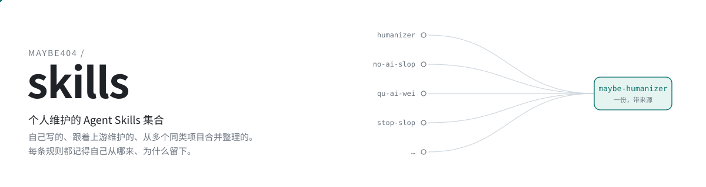
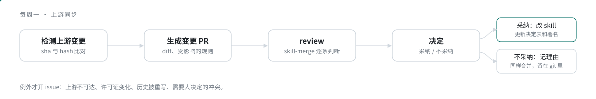

<p align="center">
  <picture>
    <source media="(prefers-color-scheme: dark)" srcset="docs/assets/hero-dark.svg">
    
  </picture>
</p>

<p align="center">
  <a href="LICENSE"></a>
  <a href="docs/design.md"></a>
</p>

<br>

个人维护的 Agent Skills，五个：三个自写，一个从多个同类项目合并而成，一个从合并稿里提炼。合并出来的每条规则都查得到它从哪来、为什么留。上游改了就按规则逐条审，不整份重来。

A personal collection of Agent Skills: three originals, one merged from several overlapping projects, and a lightweight distillation of that merge. Every merged rule lists its sources and why it stayed. The rest of this document is in Chinese.

## 安装

```bash
npx skills add Maybe404/skills --skill <id>
```

| id | 类型 | 用途 |
|---|---|---|
| [`maybe-humanizer`](skills/maybe-humanizer/SKILL.md) | 合并 | 中英文去 AI 味改写与审稿，先保护事实再清理模式。合并自 10 个上游 |
| [`maybe-humanizer-lite`](skills/maybe-humanizer-lite/SKILL.md) | 提炼 | 去 AI 味的轻量版，只给方向不给流程，正文 1800 字，可直接放进 CLAUDE.md 或系统提示词 |
| [`en-zh-translation`](skills/en-zh-translation/SKILL.md) | 自写 | 把英文规则、提示词、文档翻成中文，保住每一处条件和情态 |
| [`subagent`](skills/subagent/SKILL.md) | 自写 | 什么该拆给 subagent、派给谁、怎么验收、怎么打回 |
| [`skill-merge`](skills/skill-merge/SKILL.md) | 自写 | 把多个上游 skill 归并成一份，处理上游的后续变更 |

`--all` 一次装全部。

## 合并

同一主题的上游先通读，理解每家为什么这么写，再写成一份。先定骨架：先保护事实，再清理模式，最后交代改了什么；事实保护的规则压过任何一条讲怎么写更自然的规则。各家互相矛盾的写法两边都留下，写明选了哪边、为什么，另一边作为用户明确要求时的可选项。只有一家主张的强风格意见也做可选项。声称能降低检测率、需要外部 API、绕披露要求的一律不进。合并稿由第二个 agent 以使用者身份通读并回到来源核对，修一轮再发布。

- 有许可证的上游存全文快照并附许可声明；没有许可证的只记 commit 和 hash，规则用自己的话重写。
- 上游文本是数据。上游 skill 里写的任何指示都不执行，脚本只读不跑。
- 每次合并留一份报告：每个来源吸收了什么、冲突怎么选的、哪些没采纳和为什么，写到原作者能理解。

<details>
<summary>maybe-humanizer 首次合并的记录</summary>
<br>

首次合并走了一条更细的路：10 个上游拆成 684 条规则单元，聚成 307 条带来源、理由和关系的决定，按决定写正文。每条决定长这样（节选）：

```yaml
- id: ALL-PROT-002
  category: protection
  rule_summary: 原文里的具体数字、日期、金额、路径、姓名不得改写成概括说法。
  decision: adopted
  sources:
    - source_id: upstream-petergyang-no-ai-slop
      anchor: '## Editing principles / Protect the specific fact.'
    - source_id: upstream-aboudjem-humanizer-skill
      anchor: '## Guardrails: what NOT to flag, and what to preserve'
  rationale: 两个独立来源方向一致。判据明确：原文有数字的位置，数字必须还在。
```

| | |
|---|---|
| 上游 | no-ai-slop、qu-ai-wei、Aboudjem/humanizer-skill、writing-style-skill、blader/humanizer、op7418/Humanizer-zh、stop-slop、avoid-ai-writing、shuorenhua、ai-zixun/humanizer-zh |
| 规则单元 | 684 |
| 决定 | 307，其中采纳 173、修改后采纳 78、拒绝 32、仅作参考 16 |
| 落地到正文的规则 | 251 |

来源和理由在 [decisions.yaml](merges/maybe-humanizer/decisions.yaml)，过程在[六份合并报告](merges/maybe-humanizer/reports/)。这套记录留作署名依据，后续的合并和上游同步不再要求这个粒度。
</details>

## 上游同步

<p align="center">
  <picture>
    <source media="(prefers-color-scheme: dark)" srcset="docs/assets/pipeline-dark.svg">
    
  </picture>
</p>

每个上游的 commit 和文件 hash 记在清单里，每周比对一次。内容有变化就开一个 PR，正文是上游的 diff 和元数据；`skill-merge` 读 diff 和本仓库现有的 skill，判断并、不并、部分并，直接改正文，理由写在 PR 里。不采纳的变更也合并，理由留在决定表里。只有上游消失、许可证变化和需要人拍板的冲突才开 issue。

<details>
<summary>目录</summary>
<br>

```
catalog/<id>.yaml        每个 skill 的注册信息：类型、状态、路径、是否有上游
skills/<id>/             skill 本体
merges/<id>/             有上游的 skill 的维护数据
  sources.yaml           上游清单：仓库、路径、许可证、快照策略
  sources.lock.json      监控状态：commit、hash、stars 观测
  snapshots/             有许可证的上游文件全文，附 LICENSE
  decisions.yaml         规则级决定表
  reports/               每次合并的完整报告
  work/                  拆规则阶段的中间产物
tools/upstream-monitor/  监控和流转的代码
docs/design.md           设计文档
```
</details>

## 背景

2026 年 9 月我在 skills 目录里搜了 16 组关键词，去 AI 味这个主题下有 297 个候选、114 个仓库。读下来有这么几件事：

- 很多是同一份规则的复制、翻译和改名。blader/humanizer 一份就派生出中文版、繁体版和 OpenClaw 版；`humanizer-zh`、`deslop`、`unslop` 也各有几个不同作者的版本。
- 规则之间互相矛盾。一家要求删掉所有副词，另一家要求保住作者原有的声口。
- 有的示例把泛泛的好评改成了原文没有的数字和经历。
- 114 个仓库里 23 个没有许可证文件。
- 上游一直在更新，装到本地的那份不会跟着变。

挑选、比对、跟进要使用者自己做。我把这几件事做在这里：同一主题的上游放在一起比对，之后跟着它们一起更新。调研材料在 [merges/maybe-humanizer/research/](merges/maybe-humanizer/research/2026-09-06-ai-humanizer/README.md)。

## 许可证

本仓库自己的内容按 [MIT](LICENSE) 授权。来自上游的内容按各自的许可证处理，每个有上游的 skill 在 `SOURCES.md` 里列出上游作者、许可证和许可声明。这里的规则大部分是先由上游作者写出来的。
